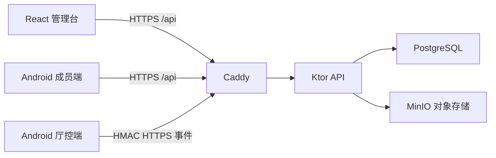

# 架构说明

## 数据隔离

- 每个业务对象都带 `organization_id`；厅房相关对象同时带 `room_id`。
- JWT 包含账号、组织和角色，仓储层查询必须同时带组织范围。
- 成员只能领取或执行分配给本人及公开任务池的作业。
- 精确流水由服务端按 `amounts.exact` 权限决定是否返回，不能只靠界面隐藏。

## 财务

- 官方账单经过文件 SHA-256、平台交易号和行指纹去重。
- 导入声明总额与计算总额不一致时，状态为 `invalid`，禁止提交。
- 结算规则按生效时间选择；结算关闭后只能追加调整单。
- 总流水、平台扣除、厅分成、成员佣金、主持费用、其他支出、应收应付和净利润均可追溯。

## 移动端

- 成员端 Room `5 -> 6`：新增中台配置、任务缓存和离线操作队列，不删除旧关系数据。
- 厅控端 Room `1 -> 2`：新增云端设备配置，不删除班次、队列、麦时、绑定、指令和本地事件。
- 厅控设备密钥使用 Android Keystore AES-GCM 加密保存；事件按 ID 幂等。

